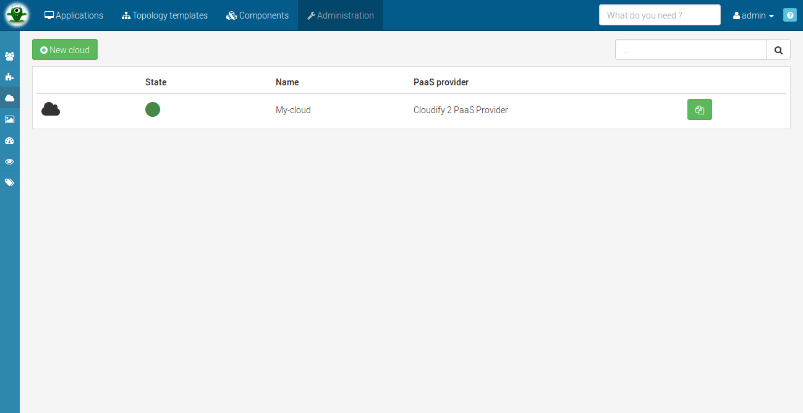
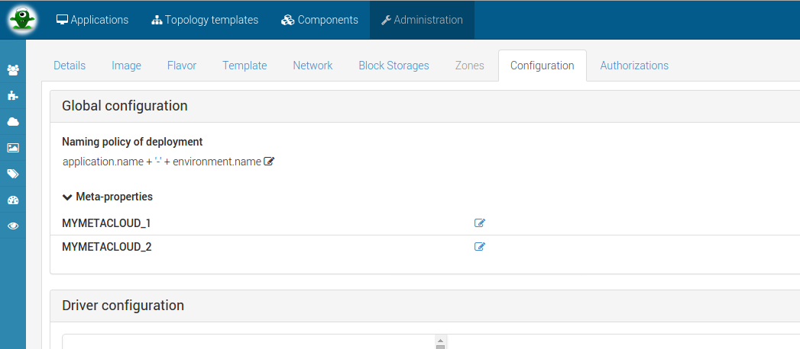
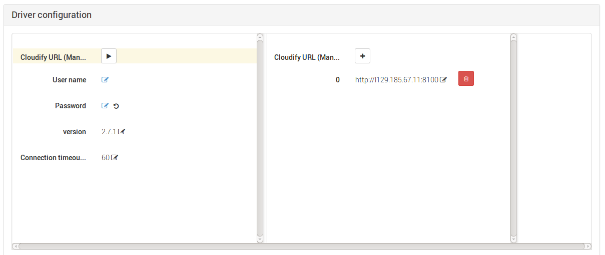
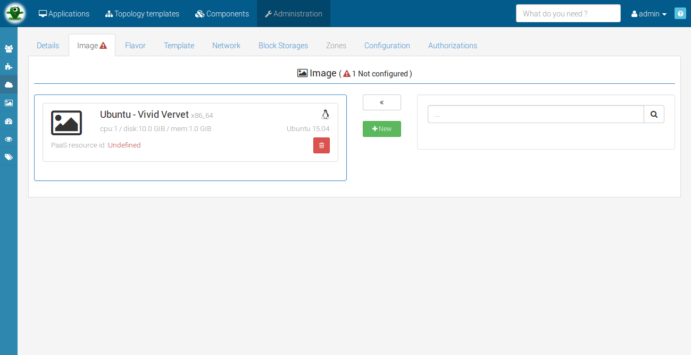
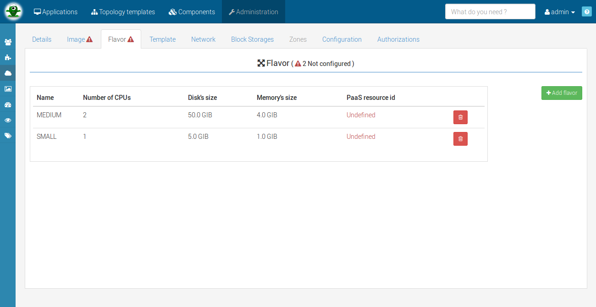
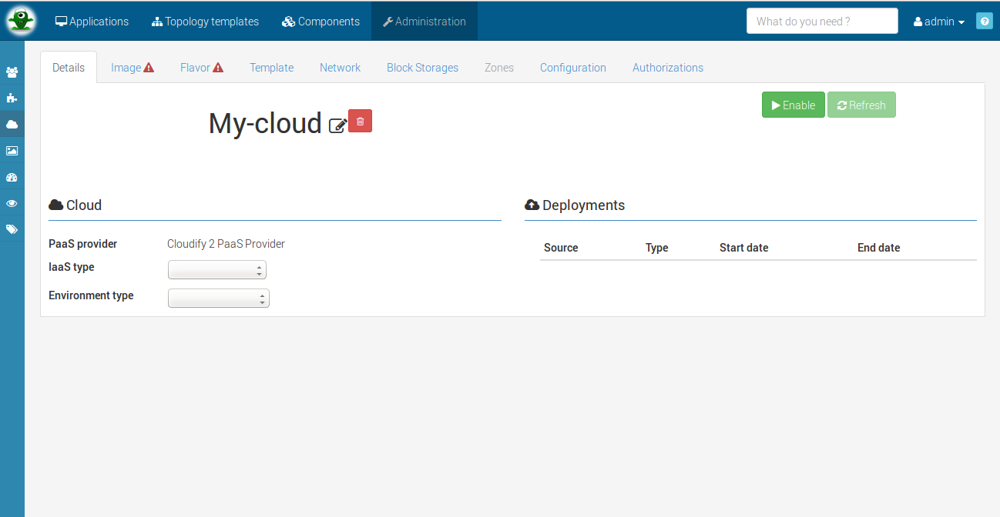
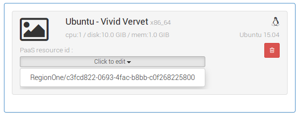



If you are not familiar with the concept of cloud in Alien 4 Cloud please go [here](#/documentation/concepts/clouds.html) first.

## Requirement for cloud creation

Alien 4 cloud is not responsible for actual deployment orchestration but rather interact with existing orchestration technologies. In order to define a cloud you must configure plugins that will be used to actually perform deployment(s) on the defined cloud. Orchestrator plugins are refered in alien as PaaS Provider plugins.

In order to configure a cloud you must have installed a paas provider plugin first see [Plugin management](#/documentation/user_guide/plugin_management.html).


<h5>Supported orchestrators</h5>
We are currently supporting the opensource orchestrators cloudify 2 and cloudify 3 (Full re-written engine with new DSL - much better and flexible but that we felt prior to the up-comming 3.2 a bit light for production use).


# Cloud creation

Once you have installed a plugin the admin can go on the cloud page and configure cloud. Remember that you can use the Alien 4 Cloud contextual help in order to be guided directly within the application. To create a cloud, just go in the *cloud list* page and click on the *new cloud* button.

# Cloud global configuration

 

## Naming policy

On every cloud, you can configure a naming policy that Alien 4 Cloud will use when deploying an application on a cloud. The naming policy will be used to identify the deployment on the cloud's orchestrator (PaaS Provider).


Most of the PaaS Providers will leverage this naming policy to name the resources used at the IaaS level also.


To compose your own application naming policy, you can use the following entities and properties :

- **environment** : the environment linked to the deployment
  * _id_
  * _name_
  * _description_
  * _environmentType_ : `OTHER, DEVELOPMENT, INTEGRATION_TESTS, USER_ACCEPTANCE_TESTS, PRE_PRODUCTION, PRODUCTION`
- **application** : deployed application
  * _id_
  * _name_
  * _creationDate_
  * _lastUpdateDate_
- **metaProperties**_['PROPERTY_NAME']_ : meta-properties defined on the application
- **time** : current date at format `yyyyMMddHHmm`

The default naming policy setting for any cloud is : `environment.name + application.name`


<h5>Deployment name unicity </h5>
The deployment name must be unique at a given time, the cloud administrator is responsible for choosing a pattern that should be unique or some application(s) may not be deployed (if a deployment with the same name is already running).
Note that in we guaranty that an application name is unique across all applications and that an environment name is unique for a given application.  
However, when generating the application paaSId (final application name on the PaaS), all `space` character will be replaced by an `_`. Therefore and as an example, if your naming policy involves the application name, you can not deploy simultaneously two applications named "**Test App**" and "**Test_App**" on the same cloud, as the generated paaSId will be in conflict.


The main pattern to define a naming policy is to use `+` to concat different properties or text, for examples :

- `environment.name + application.name + time`
- `application.id + environment.environmentType + '-US_ZONE'`
- `time + '__' + application.creationDate`
- `'MY_APP' + '-WORDPRESS-' + time`
- `metaProperties['PROPERTY_NAME'] + '-' + time`


<h5>Empty meta properties</h5>
Any empty property used in the naming policy expression will cause a deployment failure.



**Advanced use** : the policy expression is based on [SpEL](http://docs.spring.io/spring/docs/current/spring-framework-reference/html/expressions.html){:target="_blank"} (_Spring Expression Language_) and you could use its capabilities if you are familiar with it.
__Note__ : do not use the `#`


## Meta properties

This feature allows you to define **meta-properties** on your cloud and then use them in your
topology as an internal variable defined by your administrator. Obviously as a _CLOUD_DELOYER_,
_APPLICATION_USER_ or _APPLICATION_MANAGER_ you won't be able to change this value.


At this stage, we assume that you've read the tutorial part <HERE> to create global meta-properties as an ADMIN,
to be more specific you know how to create meta-properties targeting cloud, application or environment.


In __global configuration__ in the meta-properties part you should be able to define a value
for any cloud targeted meta-properties. Fill the desired values in order to use it later as in
__get_input__ for a property.


Regarding your meta-property definition, you can add constraint on a meta property. In this case you
must see constraint violation error if any in this cloud meta-properties form.


## PaaS Provider configuration

The configuration tab on the cloud view allows to setup the provider specific configuration. It is mostly used to configure the provider connexion parameters so Alien 4 Cloud can communicate with the orchestrator engine server.

This configuration may be specific to the orchestrator used and you should refer to the orchestrator specific guide. The next capture show the driver configuration of cloudify 2.


More informations for [cloudify 2](#/documentation/cloudify2_driver/install_config.html) or [cloudify 3](#/documentation/cloudify3_driver/install_config.html) can be found on her specific documentation.


# Cloud resources setup

Once created you must configure the cloud. Configuring a cloud requires several steps:

* Configure cloud resources (images and flavors) used for resources matching at deployment time.
* Configure the properties of the PaaS provider (that depends of the chosen one).

## Configure cloud resources

### Images

In this page you need to add images to your cloud. An image describes the informations of a *virtual machine template*, you need to resume the images of your PaaS.
For example, here the screen of a cloud with *Ubuntu Vivid Vervet* (the cloud is not enabled at this moment).

### Flavors

Flavor is a combination of informations to describe the *hardware templates* used by the PaaS. They are 3 informations:

* number of core
* disk size
* RAM size

Lot of flavors offer the flexibility for *APPLICATION_MANAGER* to choose the appropriate resources for an application. Like for images, here a screen of the flavor page (the cloud is not enabled at this moment).

## Configure PaaS templates

For the next step, you need to enable your cloud. Just go in the *details* page and click one the *enable* button. If the startup has failed, check your PaaS driver configuration.




When the cloud is enabled, go to *image* page to set the PaaS resource ID of your images.

Once all images are complete, the alert icon on *image* tab will be deleted : {: .inline}

After this, do the same thing with the flavor.

When an ID is set, the number of template is updated : {: .inline}



When the cloud is enabled, go to *image* page to set the PaaS resource ID of your images.

Once all images are complete, the alert icon on *image* tab will be deleted : {: .inline}

After this, do the same thing with the flavor.

When an ID is set, the number of template is updated : {: .inline}




More informations for the PaaS template of [cloudify 2](#/documentation/cloudify2_driver/install_config.html) or [cloudify 3](#/documentation/cloudify3_driver/install_config.html) can be found on her specific documentation.

